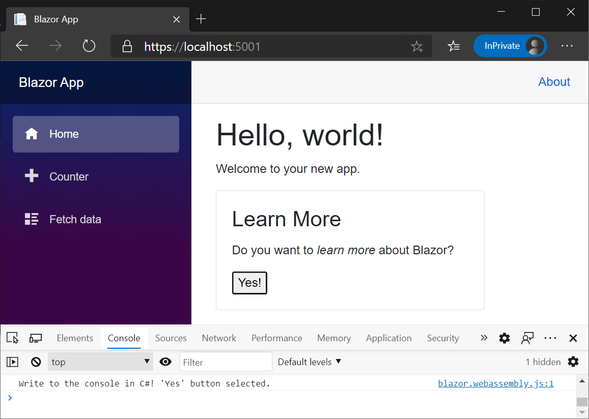
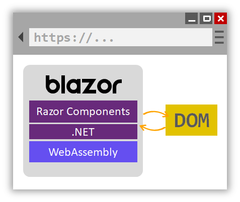

# Session 0: Installation and Blazor 101

In this session, you'll setup your machine for Blazor development and build your first Blazor app.

## Setup

To get started with Blazor, follow the instructions on https://aka.ms/blazor-getting-started.

## What is Blazor?

Blazor is a framework for building interactive client-side and server-side web UI with .NET:

- Create rich interactive UIs using C# instead of JavaScript.
- Share server-side and client-side app logic written in .NET.
- Render the UI as HTML and CSS for wide browser support, including mobile browsers.
- Integrate with modern hosting platforms, such as Docker.

Using .NET for client-side web development offers the following advantages:

- Write code in C# instead of JavaScript.
- Leverage the existing .NET ecosystem of .NET libraries.
- Share app logic across server and client.
- Benefit from .NET's performance, reliability, and security.
- Stay productive with Visual Studio on Windows, Linux, and macOS.
- Build on a common set of languages, frameworks, and tools that are stable, feature-rich, and easy to use.

Components

Blazor apps are based on components. A component in Blazor is an element of UI, such as a page, dialog, or data entry form.

Components are .NET C# classes built into .NET assemblies that:

- Define flexible UI rendering logic.
- Handle user events.
- Can be nested and reused.
- Can be shared and distributed as Razor class libraries or NuGet packages.

The component class is usually written in the form of a Razor markup page with a .razor file extension. Components in Blazor are formally referred to as Razor components. Razor is a syntax for combining HTML markup with C# code designed for developer productivity. Razor allows you to switch between HTML markup and C# in the same file with IntelliSense programming support in Visual Studio. Razor Pages and MVC also use Razor. Unlike Razor Pages and MVC, which are built around a request/response model, components are used specifically for client-side UI logic and composition.

Blazor uses natural HTML tags for UI composition. The following Razor markup demonstrates a component (`Dialog.razor`) that displays a dialog and processes an event when the user selects a button:


```razor
<div class="card" style="width:22rem">
    <div class="card-body">
        <h3 class="card-title">@Title</h3>
        <p class="card-text">@ChildContent</p>
        <button @onclick="OnYes">Yes!</button>
    </div>
</div>

@code {
    [Parameter]
    public RenderFragment ChildContent { get; set; }

    [Parameter]
    public string Title { get; set; }

    private void OnYes()
    {
        Console.WriteLine("Write to the console in C#! 'Yes' button selected.");
    }
}
```

The Dialog component is nested within another component using an HTML tag. In the following example, the Index component (`Pages/Index.razor`) uses the preceding `Dialog` component. The tag's Title attribute passes a value for the title to the Dialog component's Title property. The Dialog component's text (`ChildContent`) are set by the content of the `<Dialog>` element. When the Dialog component is added to the Index component, IntelliSense in Visual Studio speeds development with syntax and parameter completion.


```razor
@page "/"

<h1>Hello, world!</h1>

<p>
    Welcome to your new app.
</p>

<Dialog Title="Learn More">
    Do you want to <i>learn more</i> about Blazor?
</Dialog>
```

The dialog is rendered when the Index component is accessed in a browser. When the button is selected by the user, the browser's developer tools console shows the message written by the OnYes method:



## Blazor WebAssembly

Blazor WebAssembly is a single-page app (SPA) framework for building interactive client-side web apps with .NET. Blazor WebAssembly uses open web standards without plugins or recompiling code into other languages. Blazor WebAssembly works in all modern web browsers, including mobile browsers.

Running .NET code inside web browsers is made possible by WebAssembly (abbreviated wasm). WebAssembly is a compact bytecode format optimized for fast download and maximum execution speed. WebAssembly is an open web standard and supported in web browsers without plugins.

WebAssembly code can access the full functionality of the browser via JavaScript, called JavaScript interoperability, often shortened to JavaScript interop or JS interop. .NET code executed via WebAssembly in the browser runs in the browser's JavaScript sandbox with the protections that the sandbox provides against malicious actions on the client machine.



When a Blazor WebAssembly app is built and run in a browser:

- C# code files and Razor files are compiled into .NET assemblies.
- The assemblies and the .NET runtime are downloaded to the browser.
- Blazor WebAssembly bootstraps the .NET runtime and configures the runtime to load the assemblies for the app. The Blazor WebAssembly runtime uses JavaScript interop to handle DOM manipulation and browser API calls.

The size of the published app, its payload size, is a critical performance factor for an app's useability. A large app takes a relatively long time to download to a browser, which diminishes the user experience. Blazor WebAssembly optimizes payload size to reduce download times:

- Unused code is stripped out of the app when it's published by the Intermediate Language (IL) Trimmer.
- HTTP responses are compressed.
- The .NET runtime and assemblies are cached in the browser.

## Blazor Server

Blazor decouples component rendering logic from how UI updates are applied. Blazor Server provides support for hosting Razor components on the server in an ASP.NET Core app. UI updates are handled over a SignalR connection.

The runtime handles:

- Sending UI events from the browser to the server.
- Applying UI updates to the rendered component that are sent back by the server.

The connection used by Blazor Server to communicate with the browser is also used to handle JavaScript interop calls.


## JavaScript interop

For apps that require third-party JavaScript libraries and access to browser APIs, components interoperate with JavaScript. Components are capable of using any library or API that JavaScript is able to use. C# code can [call into JavaScript code](https://docs.microsoft.com/en-us/aspnet/core/blazor/call-javascript-from-dotnet?view=aspnetcore-5.0), and JavaScript code can [call into C# code](https://docs.microsoft.com/en-us/aspnet/core/blazor/call-dotnet-from-javascript?view=aspnetcore-5.0).

## Code sharing and .NET Standard

Blazor implements the .NET Standard, which enables Blazor projects to reference libraries that conform to .NET Standard specifications. .NET Standard is a formal specification of .NET APIs that are common across .NET implementations. .NET Standard class libraries can be shared across different .NET platforms, such as Blazor, .NET Framework, .NET Core, Xamarin, Mono, and Unity.

APIs that aren't applicable inside of a web browser (for example, accessing the file system, opening a socket, and threading) throw a [PlatformNotSupportedException](https://docs.microsoft.com/dotnet/api/system.platformnotsupportedexception).


## Build your first app

Generate a first Blazor Server application using this command at the command-line:

```dotnetcli
dotnet new blazorserver -o FirstApp
```

Explore the Counter and Weather demos to see how they interact with HTML and C# as well as fetch data from the server.

Once you have your first Blazor app running, try [building your first Blazor app](https://docs.microsoft.com/aspnet/core/tutorials/build-your-first-blazor-app).

Next up - [Demo 1: eShopOnBlazor](01-eshop-on-blazor.md)