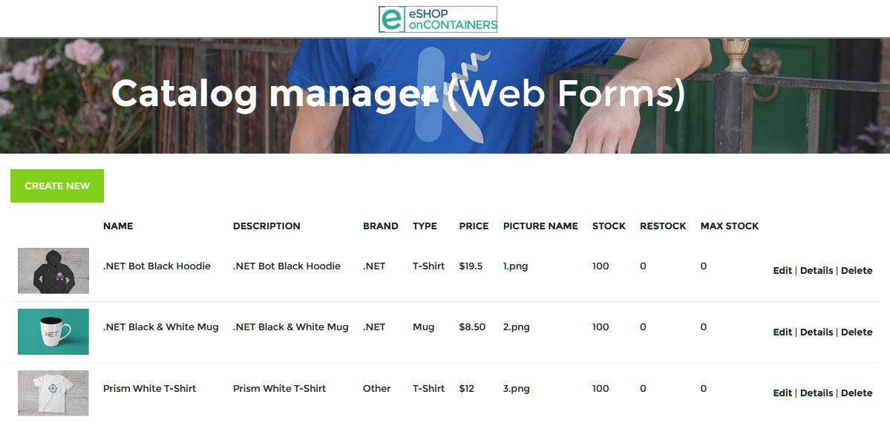

# Demo 1: eShopOnBlazor

This application was originally written as part of the feasibility exploration of the [Blazor for Web Forms Developers eBook](https://docs.microsoft.com/dotnet/architecture/blazor-for-web-forms-developers/) planning.  We already had the eShopOnWebForms sample project, and wanted to explore the feasibility of doing a migration to Blazor.

The [sample version included with this project](../src/01-eShopOnBlazor) in the `src/01-eShopOnBlazor` folder has been updated to .NET 5 and is created as a direct interpretation of the ASP.NET Web Forms content and controls intent of the original application.  Open this solution with Visual Studio 2019 and explore the differences between the two projects.

---
**NOTE**

You may need to force the NuGet packages to be restored in the eShopLegacyWebForms project by issuing the command in the project folder at the command-line:

```dotnetcli
nuget restore -force -nocache
```



## Learning from the Home Page

The home page of the application is a list of the entire catalog of products.  There's a defined layout with an HTML table formatting the collection of products.

In the Web Forms version of the project, the layout is specified in `Site.Master` and in the Blazor version the layout is defined in `Shared\MainLayout.razor`

_Site.Master contents_

```aspx-csharp
<header class="navbar navbar-light navbar-static-top">
  <div class="esh-header-brand">
    <a runat="server" href="~/">
      
    </a>
  </div>
</header>

<section class="esh-app-hero">
  <div class="container esh-header">
    <h1 class="esh-header-title">Catalog manager <span>(Web Forms)</span></h1>
  </div>
</section>

<div>
  <asp:ContentPlaceHolder ID="MainContent" runat="server">
  </asp:ContentPlaceHolder>
</div>

<footer class="esh-app-footer">
  <div class="container">
    <article class="row">
      <section class="col-sm-6">
        
      </section>
      <section class="col-sm-6">
        
        <br />
        <small style="color:white"><asp:Label ID="SessionInfoLabel" runat="server"></asp:Label></small>
      </section>
    </article>
  </div>
</footer>
```

```razor
<header class="navbar navbar-light navbar-static-top">
    <div class="esh-header-brand">
        <a href="">
            
        </a>
    </div>
</header>

<section class="esh-app-hero">
    <div class="container esh-header">
        <h1 class="esh-header-title">Catalog manager <span>(Blazor)</span></h1>
    </div>
</section>

<div>
    @Body
</div>

<footer class="esh-app-footer">
    <div class="container">
        <article class="row">
            <section class="col-sm-6">
                
            </section>
            <section class="col-sm-6">
                
                <br />
                <small style="color:white">@Environment.MachineName, @SessionStartTime</small>
            </section>
        </article>
    </div>
</footer>
```

With a few minor differences in how the session is initialized, the machine name is acquired, and the controls to place those elements on screen, the layouts are identical.

It's in the comparison of `Default.aspx` and `Pages\Index.razor` that we start to see some of the conversions we will need to make:

```aspx-csharp
    <div class="esh-table">
        <p class="esh-link-wrapper">
            <a runat="server" href="<%$RouteUrl:RouteName=CreateProductRoute%>" class="btn esh-button esh-button-primary">
                Create New
            </a>
        </p>

        <asp:ListView ID="productList" ItemPlaceholderID="itemPlaceHolder" runat="server" ItemType="eShopLegacyWebForms.Models.CatalogItem">
            <EmptyDataTemplate>
                <table>
                    <tr>
                        <td>No data was returned.</td>
                    </tr>
                </table>
            </EmptyDataTemplate>
            <LayoutTemplate>
                <table class="table">
                    <thead>
                        <tr class="esh-table-header">
                            <th></th>
                            <th>Name</th>
                            <!-- Omitted for brevity -->
                        </tr>
                    </thead>
                    <tbody>
                        <asp:PlaceHolder runat="server" ID="itemPlaceHolder"></asp:PlaceHolder>
                    </tbody>
                </table>
            </LayoutTemplate>
            <ItemTemplate>
                <tr>
                    <td>
                        <image class="esh-thumbnail" src='/Pics/<%#:Item.PictureFileName%>' />
                    </td>
                    <td>
                        <p>
                            <%#:Item.Name%>
                        </p>
                    </td>
                </tr>
            </ItemTemplate>
        </asp:ListView>
    </div>
```

```razor
<div class="esh-table">
    <p class="esh-link-wrapper">
        <a href="Catalog/Create" class="btn esh-button esh-button-primary">
            Create New
        </a>
    </p>

    @if (paginatedCatalogItems == null || !paginatedCatalogItems.Data.Any())
    {
        <table>
            <tr>
                <td>No data was returned.</td>
            </tr>
        </table>
    }
    else
    {
        <table class="table">
            <thead>
                <tr class="esh-table-header">
                    <th></th>
                    <th>Name</th>
                    <!-- Omitted for brevity -->
                </tr>
            </thead>
            <tbody>
                @foreach (var catalogItem in paginatedCatalogItems.Data)
                {
                    <tr>
                        <td>
                            
                        </td>
                        <td>
                            <p>@catalogItem.Name</p>
                        </td>
                    </tr>
                }
            </tbody>
        </table>
    }
</div>
```

Now we see some differences:

- `asp:Content` tag wraps the page
- `asp:ListView` control presents the content
- Routing in building links in the ASPX, simple hrefs in A tags in Blazor

The layout and the formatting are the same.  There is some reformatting and repurposing of controls that we need to accommodate with Blazor, and we can replace them with (at the simplest) the desired HTML that was originally rendered by the Web Forms control.

Take some time to explore how the ASPX files compare to the razor files in these two projects.

Previous - [Session 0: Installation and Blazor 101](00-installation-and-blazor-101.md)

Next up - [Session 1: WebForms and Blazor Comparison](02-webforms-and-blazor-comparison.md)