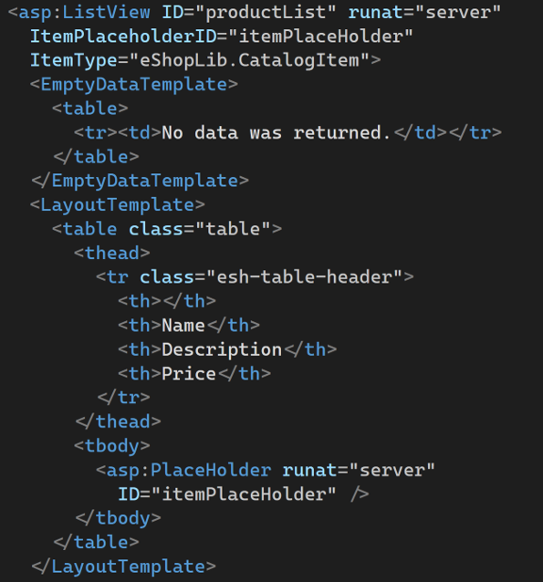
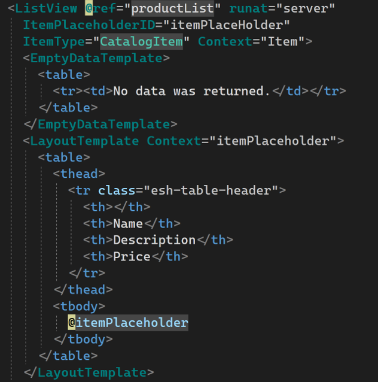
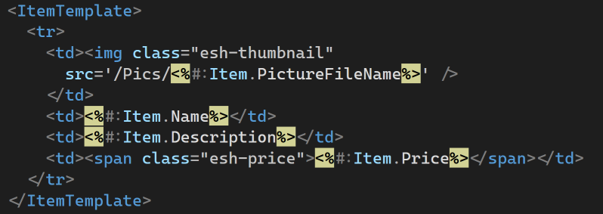
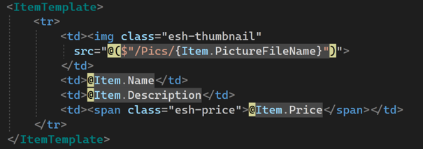

# Migrating Pages

Forms, the ASPX files in Web Forms, can be located and have a similar behavior in Blazor if you move and create files in the `/Pages` folder using the razor templating language.  We can simplify our interactions or even build some components to help migrate our content.

The code-behind of our files can be migrated to similar code-behind class files that go with our razor templates.  Let's walk through migrating the `default.aspx` page from eShopOnWebForms to Blazor

## Step 1: Prepare Blazor Server-Side Project

Create a new Blazor server-side project and add a reference to the `eShop.Core` project we created in the previous lab.  You can create this project and add it to the solution with these commands:

```dotnetcli
dotnet new blazorserver -o eShopOnBlazor
dotnet sln add eShopOnBlazor
```

Remove the files in the `/Data` folder and the following razor files:

- `/Shared/Nav.razor`
- `/Pages/Counter.razor`
- `/Pages/FetchData.razor`

Finally, remove the entry in `Startup.cs` that references the WeatherForecast service.

## Step 2: Add References to the Business Logic library

In the previous lab, we built a library with our business logic to fetch data and work with our catalog of data.  Since this library is built with .NET Standard, it can be used both in the .NET Framework project and our Blazor project.

From the eShopOnBlazor folder, you can add a reference to the business logic project with this command:

```dotnetcli
dotnet add reference ../eShop.Core
```

Next, we need to configure our Blazor application to access the services exposed in this class library.  In the `Startup` class `ConfigureServices` method, add this call to configure the data repository services:

```csharp
services.AddSingleton<ICatalogService, CatalogServiceMock>();
```

## Step 3: Copy over static files

All of the CSS, fonts, and images folders can be copied directly into the `/wwwroot` folder of the Blazor project.  We won't need the JavaScript in our Blazor application.

## Step 4: Migrate the Master Pages to Layout

The layout for our Blazor application is composed of the `/Pages/_Host.cshtml` file and the `/Shared/MainLayout.razor` file.  All of the static HTML references like CSS stylesheets and JavaScript pages should be copied into the `/Pages/_Host.cshtml` file with CSS links in the header and if we had JavaScript references, they would be added just above the closing body tag.  

The HTML body contents, minus the scripts of the `Site.Master` file can be copied directly into the `MainLayout.razor`.

Replace the `<asp:ContentPlaceHolder>` tag with the razor `@Body` command.  Just like in Web Forms, this is where our content will be output.

## Step 5: Migrate the Index Page

Here is the first page that needs significant modification.  In the `/Pages/index.razor` file, replace the contents below the `@page` directive with the markup inside the `<asp:Content>` tags from the `Default.aspx` file.

All of the `<% %>` content tags and Web Forms tags need to be replaced with a Blazor equivalent.  Fortunately, the `runat="server"` code is ignored and we can leave it in place for now.  There are several strategies to re-activate our page more quickly:

### Enter BlazorWebFormsComponents

The [BlazorWebFormsComponents](https://github.com/FritzAndFriends/BlazorWebFormsComponents) is a community project that seeks to deliver the base ASP.NET controls as Blazor components that render the same markup with the same properties and attributes as their corresponding ASP.NET controls.  Let's add a reference to these components and take care of the ListView control quickly.

```dotnetcli
dotnet add package Fritz.BlazorWebFormsComponents
```

The conversion from `<asp:ListView>` to Blazor `<ListView>` looks like the following:

| ASP.NET Web Forms | Blazor |
| --- | --- |
|  |  |
|  |  |

The `Context` attribute on the `<ListItem>` Blazor component is set to `Item` so that the same `Item` reference to the `CatalogItem` can be used to format the content of the List.

The components also provide a stubbed [DataBinder](https://fritzandfriends.github.io/BlazorWebFormsComponents/UtilityFeatures/Databinder/) that you can also use if your Web Forms code uses the DataBinder.  This allows you to migrate syntax directly to Blazor.

The `asp:HyperLink` tags can be shortened to just `<HyperLink>` and will generate hyperlinks appropriately, but we need to fix the `NavigateUrl` properties.  That needs to be handled in our next strategy.

### Migrate the Code-Behind for data access

The data fetch logic of this page was migrated to use an `ICatalogService` object injected with Autofac.  In Blazor, we have a dependency injection container natively available and this can be injected by adding this directive to the top of the page:

```razor
@inject ICatalogService CatalogService
```

Next, add this code block at the bottom of the page to preform the data interaction:

```razor
@code {
int pageSize = 10;
int pageIndex = 0;
PaginatedItemsViewModel<CatalogItem> paginatedCatalogItems;

protected override void OnParametersSet() => LoadPage();

void Previous()
{
  pageIndex--;
  LoadPage();
}

void Next()
{
  pageIndex++;
  LoadPage();
}

void LoadPage()
{
  paginatedCatalogItems = CatalogService.GetCatalogItemsPaginated(pageSize, pageIndex);
}

}
```

### Brute Force - Review each block of code

The code in our "bee-sting" notation `<% %>` needs to be evaluated and updated to Razor-compliant C#.  We can review each block and _HOPEFULLY_ just reformat the markup by doing either:

- Replace the leading `<%` with a `@` on implicit statements
- In code blocks, replace `<% %>` with `@{ }`

You should review each code block to ensure it is Blazor appropriate.

The anchor tags that reference and use the `RouteUrl` method to identify application URLs need to be replaced with the hard-coded new locations of our Product Create, Product Edit, Product Details, and Product Delete pages.

### BONUS: Use CodeFactory with the Blazor Migration Template

The BlazorWebFormsComponents team has been working with [CodeFactory](https://codefactory.software) to provide a CodeFactory template that runs inside of Visual Studio 2019 that will allow you to migrate ASPX files directly to a new Blazor project.

The template is in-progress and gaining new features as more feedback is received and more features are added to the BlazorWebFormsComponents.  The migration will copy over your code-behind as a Blazor partial class and you will be able to re-connect that logic to your pages.

Download the [WebForms2BlazorServer](https://github.com/CodeFactoryLLC/WebForms2BlazorServer) template with the CodeFactory runtime to activate in Visual Studio 2019.


Previous - [Lab 1: Business Logic & .NET Standard](03-business-logic.md)

Next up - [Lab 2: Migrating eShopOnWebForms](05-migrating-site.md)
